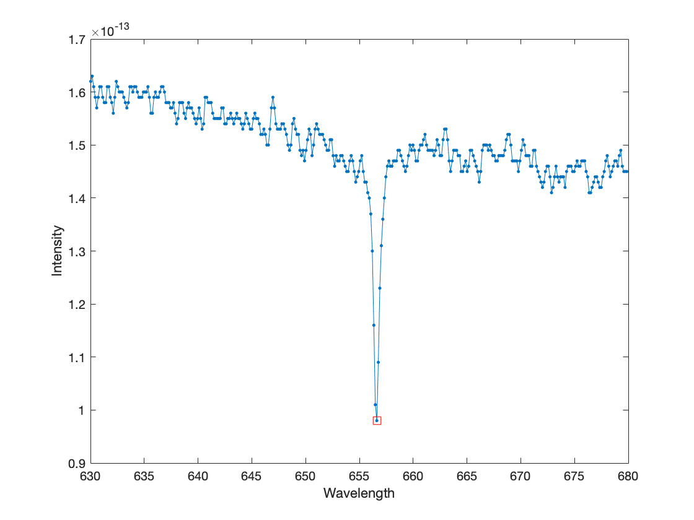

# Stellar Motion Project

## About the Project

The Stellar Motion project determines the speed at which stars move away from Earth based on the characteristic spectrum of starlight. By analyzing the wavelength of the hydrogen alpha line in a star's spectrum, specifically focusing on star HD94028, we can decipher the star's motion relative to Earth.

For a detailed explanation of the theory behind this project, refer to the [Stellar Motion Project on MATLAB](https://matlabacademy.mathworks.com/R2023b/portal.html?course=gettingstarted#chapter=13&lesson=1&section=1).

## Project Structure

- `stellar_motion.m`: This script plots signal frequency data.
- `spectrum_data.mat`: Contains spectra data for various stars. The data for star HD94028 is in the sixth column.

## Expected Output

Upon successful execution, the script generates plots illustrating signal frequency data. Check the `results` directory for visualizations.

---

**This project is part of MathWorks's [MATLAB Onramp Course](https://matlabacademy.mathworks.com/R2018b/portal.html?course=gettingstarted) | [Project Tutorial](https://matlabacademy.mathworks.com/R2018b/portal.html?course=gettingstarted#chapter=14&lesson=1&section=1).**
